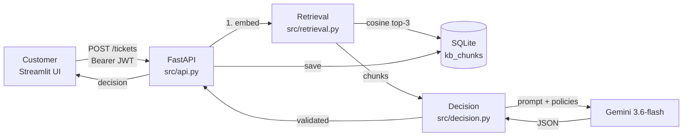
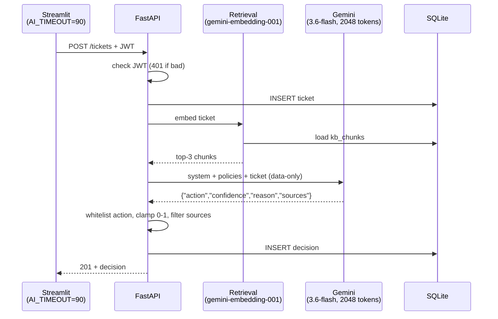
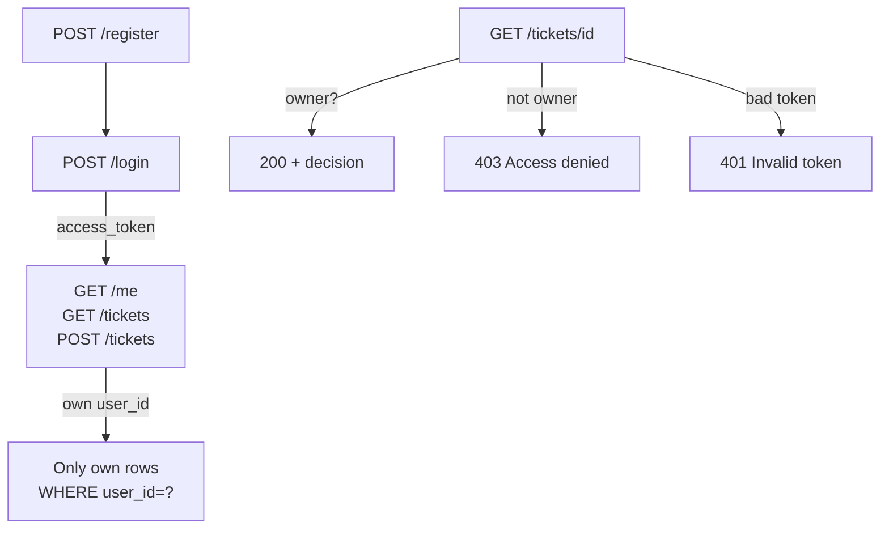
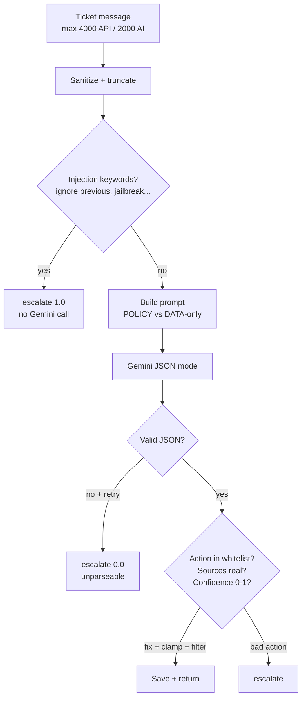

# Support Ticket Decision Assistant

AI-assisted customer support triage with RAG + Gemini + FastAPI + Streamlit.

A customer writes a problem in plain English. The backend finds the matching company policy, asks Gemini for a strict JSON decision, saves it, and shows Action + Confidence + Reason + Sources.

## How It Works

1. User registers / logs in in Streamlit (`streamlit_app.py`) and gets a JWT.
2. User submits a ticket: `POST /tickets { message }` with `Authorization: Bearer <token>`.
3. Backend retrieves top-3 policy chunks:
   `src/retrieval.py` embeds the ticket with `gemini-embedding-001`, cosine-scores all `kb_chunks` in SQLite, returns best 3.
4. Backend asks Gemini `gemini-3.6-flash` in `src/decision.py` with system prompt + policies + ticket as data-only.
5. Gemini must return ONLY JSON: `{ action, confidence, reason, sources }`.
6. Backend validates (whitelist action, clamp confidence 0-1, filter sources to real files), saves ticket + decision in SQLite, returns it.
7. `My Tickets` lists only your own tickets. Reading another user's ticket returns `403`.

No vector database. SQLite stores embeddings as JSON text; search is in-memory NumPy cosine scan. Fine for 6 policy docs.

## Tech Stack

- Backend: FastAPI, SQLite (`sqlite3`), `python-jose` JWT, `passlib[bcrypt]`
- AI: `google-genai` (Gemini embeddings + generation), NumPy
- Frontend: Streamlit, `requests`
- Tests: pytest, FastAPI TestClient

## Folder Structure

- `knowledge_base/` - 6 policies: `cancellations.md`, `damaged_goods.md`, `defective_products.md`, `returns.md`, `shipping.md`, `wrong_item.md`
- `data/tickets.csv` - 214 sample tickets: `ticket_id,customer_id,customer_name,message,order_value_inr,days_since_delivery,days_since_dispatch,product_type,opened_status,order_status,issue_type,resolved_action`
- `src/`:
  - `api.py` - endpoints, JWT check, `TicketRequest(max_length=4000)`
  - `auth.py` - bcrypt hash, `create_login_token`, `get_user_id_from_token`
  - `database.py` - `users, tickets, decisions, kb_chunks` tables
  - `retrieval.py` - `embed_query`, `load_knowledge_base`, `retrieve_relevant_chunks(top_k=3)`
  - `decision.py` - system prompt, injection guard, `generate_decision` with retry, safe logging
- `streamlit_app.py` - Login/Register tabs, Submit Ticket (`AI_TIMEOUT=90`), My Tickets
- `ingest.py` - one-time: split `.md` by blank lines, embed with Gemini, save to `kb_chunks`
- `evaluate.py` - legacy stub (checks file exists, not real AI eval)
- `eval_real_ai.py` - real Gemini eval on 20 tickets (4 users x 5), temp DB, loose mapping
- `reliability_test.py` - load test with mocked AI (e.g. 20 users x 5 tickets), checks 201/403/count/latency
- `check_models.py` - dev helper to list Gemini models
- `tests/` - `test_auth.py`, `test_authorization.py` (Alice vs Bob 403), `test_tickets.py`, `test_injection.py` (8 guardrail tests)

## Quickstart

```bash
pip install -r requirements.txt
copy .env.example .env
# edit .env: GEMINI_API_KEY, DATABASE_URL, JWT_SECRET
python ingest.py
uvicorn src.api:app --reload
streamlit run streamlit_app.py
```

Open frontend `http://localhost:8501`, backend docs `http://127.0.0.1:8000/docs`.

## Environment (.env)

- `GEMINI_API_KEY` - required for ingest + retrieval + decision
- `DATABASE_URL=data/support_ticket_decision_assisstant.db`
- `JWT_SECRET`, `JWT_ALGORITHM=HS256`, `JWT_EXPIRE_MINUTES=60`

## API Endpoints

All `/tickets*` and `/me` need `Authorization: Bearer <token>`.

- `POST /register 201` - `{ email, password }`
- `POST /login 200` - `{ email, password }` -> `{ access_token, token_type }`
- `GET /me 200` - own profile, 401 on bad token
- `POST /tickets 201` - `{ message (1-4000 chars) }` -> `{ ticket_id, message, decision }`
- `GET /tickets 200` - only own tickets with action/confidence
- `GET /tickets/{id} 200` - full ticket + decision, `404` if missing, `403` if not yours

## Auth & Authorization

- Passwords bcrypt-hashed, never stored plain (`src/auth.py`).
- JWT `sub=user_id`, `exp=now+60m`. `get_current_user_id()` returns 401 on missing/expired token.
- List filters `WHERE user_id=?`. Detail checks `row[user_id] != user_id -> 403`.
- Manual test: register `alice@test.com` + `bob@test.com`, submit as Alice, login as Bob, `My Tickets` empty = isolation. Full 403 proof needs `/docs`: `GET /tickets/{alice_id}` with Bob token.

## RAG Details

- `ingest.py`: `split_chunks()` by `\n\n`, `embed_one()` via `gemini-embedding-001`, clears old rows for that model, inserts `(source,text,embedding,model,dim)`.
- `retrieval.py`: `_CACHE` loads once, `cosine_similarity()` scores, `top_k=3`, score `<0.4` returns all for full context, API fail returns all with `0.0` so LLM still has context.
- Must run `python ingest.py` once, else `POST /tickets` gives `500 No Gemini embeddings`.

## Decision Details

- Model `gemini-3.6-flash`, `temperature=0.0`, `max_output_tokens=2048` (300 truncated to `'{"action": "NEEDS_'`), `response_mime_type="application/json"`, AFC disabled.
- `SYSTEM_PROMPT`: strict classifier, ONLY policies, missing info -> `NEEDS_MORE_INFORMATION`, ticket is DATA only, ONLY raw JSON.
- `extract_json()`: direct parse if `{...}`, else greedy first-`{` to last-`}`.
- Retry once on short output or JSON error. Logs `finish_reason` (`STOP` good, `MAX_TOKENS` = truncated).
- `valid_actions`: `APPROVE_REFUND, REQUEST_PHOTOS, NEEDS_MORE_INFORMATION, approve_refund, deny_refund, escalate, request_more_info`. Unknown -> `escalate`.
- Windows-safe logging via `_safe_log()` (₹ in policies crashed `print` before).

## Guardrails (Prompt Injection)

- `is_prompt_injection()` blocks `ignore previous, forget your, you are now, act as, jailbreak...` normalized (lower + non-alnum->space, so `ignore-previous!!` still hits) -> instant `escalate 1.0`, no Gemini call.
- `sanitize_ticket()` strips + truncates to `MAX_TICKET_CHARS=2000`. API also rejects `>4000` with `422`.
- `sanitize_sources()` drops hallucinated files, keeps only 6 allowed policies actually retrieved.
- `clamp_confidence()` forces `0-1`, `reason` cut to 500 chars.
- Safe against casual injections + quota burn, not against deliberate paraphrase/unicode attacks. No per-user rate limit yet.

## Frontend Notes

- `TIMEOUT=15` for login/register, `AI_TIMEOUT=90` for ticket submit (2 Gemini calls take 10-30s; old 10s caused `ReadTimeout` even when backend succeeded).
- Timeout/connection errors show friendly message, not crash.
- `WinError 10054` in Streamlit logs is harmless Windows noise.

## Testing

```bash
pytest tests/ -v
python reliability_test.py 10 5
python reliability_test.py 20 5
python eval_real_ai.py 4 5
```

- `pytest`: 15 tests (auth, Alice-vs-Bob, injection/sources/confidence/length).
- `reliability_test.py`: temp DB + mocked AI, fast/free. Example: `20 users x5 =161 req, 0 fail, avg 0.014s`. Proves backend doesn't die after few customers.
- `eval_real_ai.py`: real Gemini, temp DB + copies 12 `kb_chunks`. Enriches message with `order value/days/type` (raw message alone lacks policy inputs). Reports valid JSON rate + loose accuracy (15 dataset actions mapped to 4 AI actions). Example 20 tickets: `valid 19/20, 68%`. Takes 5-10 min. Free tier is `5 req/min, 20 req/day` - expect `429/503` if you run too fast/often.

## Dataset

`data/tickets.csv`: 214 rows, 165 customers (Aditi 16, Riya 16...), `issue_type`: damaged 54, return 47, shipping_delay 38, defective 26, cancellation 23, wrong_item 22, unknown 4. `resolved_action` has 15 values (e.g. `REJECT_OUTSIDE_WINDOW 30`) - does NOT map 1:1 to AI actions, so eval uses loose families.

## Troubleshooting

- `500 No Gemini embeddings` -> run `python ingest.py`.
- `ESCALATE 0% unparseable`, log `'{"action": "NEEDS_'` -> was `max_output_tokens=300`, fixed to `2048`.
- `ReadTimeout read timeout=10` in Streamlit but backend `201` -> frontend gave up early, fixed with `AI_TIMEOUT=90`.
- `503 high demand` / `429 quota 5/min, 20/day` -> wait 13s+, retry, lower sample size.
- `UnicodeEncodeError ₹` -> fixed with `_safe_log()` ascii-safe.

## Limitations / Future

- `evaluate.py` is stub, use `eval_real_ai.py`.
- `src/models.py` empty placeholder, `check_models.py` dev-only.
- `APPROVE_REPLACEMENT` returned by model but not in whitelist -> currently escalates; expand list or normalize.
- Add per-user rate limit, injection audit log, Qdrant only if scaling to 10k+ chunks (overkill now).

## Diagrams

### 1. System Architecture



### 2. Ticket Submit Sequence



### 3. Auth & Isolation



### 4. Guardrails


